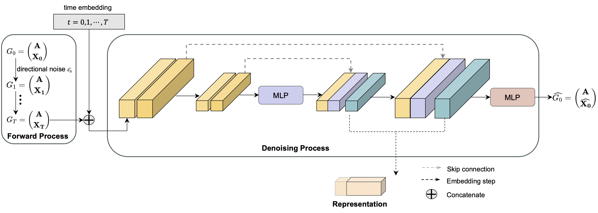
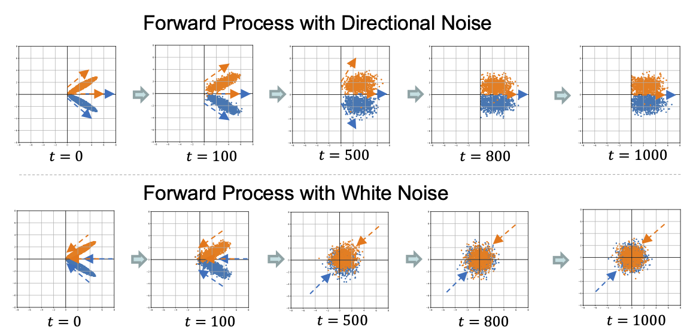

# Directional Diffusion Models
## [NeurIPS 2023](https://arxiv.org/abs/2306.13210)

Run Yang<sup>1</sup>, Yuling Yang<sup>1</sup>, Fan Zhou<sup>1</sup>, Qiang Sun<sup>2</sup> <br>
<sup>1</sup>Shanghai University of Finance and Economics, <sup>2</sup>University of Toronto

We introduce a novel class of models termed **directional diffusion models (DDM)**, which adopt data-dependent, anisotropic, and directional noises in the forward diffusion process. This code is an implementation of **DDM** on 12 public graph datasets.
### Graph classification datasets
- IMDB-B
- IMDB-M
- COLLAB
- REDDIT-B
- PROTEINS
- MUTAG
### Node classification datasets
- CORA
- Citeseer
- PubMed
- Ogbn-arxiv
- Amazon-Computer
- Amazon-Photo

## Framework

## Usage
```shell
conda create -n ddm python=3.8
conda activate ddm
cd ddm-nni
pip install -r requirements.txt
```

cd to EXP path(```MUTAG``` for example)
```shell
cd GraphExp
python main_graph.py --yaml_dir ./yamls/MUTAG.yaml
```
**In view of the sensitivity of diffusion method to hyperparameters, it is recommended to use hyperparameter search methods like NNI to achieve better results**
**Trust me ! In this way, you can achieve better results than what is presented in the paper**

## Performance
### Directional noise v.s. white noise

### Graph classification(F1-score)
|     |IMDB-B|IMDB-M|COLLAB|REDDIT-B|PROTEINS|MUTAG|
|:---:|:----:|:----:|:----:|:------:|:------:|:---:|
|GIN[1]     | 75.1±5.1  | 52.3±2.8  | 80.2±1.9 | 92.4±2.5 | 76.2±2.8  | 89.4±5.6    |
|DiffPool[2]| 72.6±3.9  | -         | 78.9±2.3 | 92.1±2.6 | 75.1±2.3  | 85.0±10.3   |
|Infograph[3] | 73.03±0.87| 49.69±0.53| 70.65±1.13 | 82.50±1.42 | 74.44±0.31| 89.01±1.13  |
|GraphCL[4] | 71.14±0.44| 48.58±0.67| 71.36±1.15 | 89.53±0.84 | 74.39±0.45| 86.80±1.34  |
|JOAO[5]    | 70.21±3.08| 49.20±0.77| 69.50±0.36 | 85.29±1.35 | 74.55±0.41| 87.35±1.02  |
|GCC[6]     | 72        | 49.4      | 78.9     | 89.8     | -         | -           |
|MVGRL[7]   | 74.20±0.70| 51.20±0.50| -        | 84.50±0.60 | -         | 89.70±1.10  |
|GraphMAE[8]| 75.52±0.66| 51.63±0.52| 80.32±0.46 | 88.01±0.19 | 75.30±0.39| 88.19±1.26  |
|**DDM** |**76.40±0.22**|**52.53±0.31**|**81.72±0.31**|89.15±1.3|**75.74±0.50**|**91.51±1.45**|
### Node classification(F1-score)
|Dataset  | Cora     | Citeseer    | PubMed    | Ogbn-arxiv | Computer| Photo |
|:---:|:----:|:----:|:----:|:------:|:------:|:---:|
|GAT      | 83.0 ± 0.7 | 72.5 ± 0.7    | 79.0 ± 0.3  | 72.10 ± 0.13 | 86.93 ± 0.29            | 92.56 ± 0.35              |
|DGI[9]      | 82.3 ± 0.6 | 71.8 ± 0.7    | 76.8 ± 0.6  | 70.34 ± 0.16 | 83.95 ± 0.47          | 91.61 ± 0.22              |
|MVGRL[7]    | 83.5 ± 0.4 | 73.3 ± 0.5    | 80.1 ± 0.7  | -          | 87.52 ± 0.11          | 91.74 ± 0.07              |
|BGRL[10]     | 82.7 ± 0.6 | 71.1 ± 0.8    | 79.6 ± 0.5  | 71.64 ± 0.12 | 89.68 ± 0.31          | 92.87 ± 0.27              |
|InfoGCL[11]  | 83.5 ± 0.3 | 73.5 ± 0.4    | 79.1 ± 0.2  | -          | - | -     |
|CCA-SSG[12]  | 84.0 ± 0.4 | 73.1 ± 0.3    | 81.0 ± 0.4  | 71.24 ± 0.20 | 88.74 ± 0.28          | 93.14 ± 0.14              |
|GPT-GNN[13]  | 80.1 ± 1.0 | 68.4 ± 1.6    | 76.3 ± 0.8  | -          | - | -     |
|GraphMAE[8] | 84.2 ± 0.4 | 73.4 ± 0.4    | 81.1 ± 0.4  | 71.75 ± 0.17 | 88.63 ± 0.17         | 93.63 ± 0.22              |
|**DDM** |**83.4±0.2**|**74.3±0.3**|**81.7±0.8**|71.29±0.18|**90.56±0.21**|**95.09±0.18**|

## References

[1]:Xu, K., Hu, W., Leskovec, J., and Jegelka, S. (2018). How powerful are graph neural networks?
arXiv preprint arXiv:1810.00826.<br>
[2]:Ying, Z., You, J., Morris, C., Ren, X., Hamilton, W., and Leskovec, J. (2018). Hierarchical graph
representation learning with differentiable pooling. Advances in neural information processing
systems, 31.<br>
[3]:Sun, F.-Y., Hoffmann, J., Verma, V., and Tang, J. (2019). Infograph: Unsupervised and semi-
supervised graph-level representation learning via mutual information maximization. arXiv preprint
arXiv:1908.01000.<br>
[4]:You, Y., Chen, T., Sui, Y., Chen, T., Wang, Z., and Shen, Y. (2020). Graph contrastive learning with
augmentations. Advances in neural information processing systems, 33:5812–5823.<br>
[5]:You, Y., Chen, T., Shen, Y., and Wang, Z. (2021). Graph contrastive learning automated. In
International Conference on Machine Learning, pages 12121–12132. PMLR.<br>
[6]:Qiu, J., Chen, Q., Dong, Y., Zhang, J., Yang, H., Ding, M., Wang, K., and Tang, J. (2020). Gcc:
Graph contrastive coding for graph neural network pre-training. In Proceedings of the 26th ACM
SIGKDD international conference on knowledge discovery & data mining, pages 1150–1160.<br>
[7]:Hassani, K. and Khasahmadi, A. H. (2020). Contrastive multi-view representation learning on graphs.
In International conference on machine learning, pages 4116–4126. PMLR.<br>
[8]:Hou, Z., Liu, X., Dong, Y., Wang, C., Tang, J., et al. (2022). Graphmae: Self-supervised masked
graph autoencoders. arXiv preprint arXiv:2205.10803.<br>
[9]:Velickovic, P., Fedus, W., Hamilton, W. L., Liò, P., Bengio, Y., and Hjelm, R. D. (2019). Deep graph
infomax. ICLR (Poster), 2(3):4.<br>
[10]:Thakoor, S., Tallec, C., Azar, M. G., Azabou, M., Dyer, E. L., Munos, R., Veliˇckovi ́c, P., and
Valko, M. (2021). Large-scale representation learning on graphs via bootstrapping. arXiv preprint
arXiv:2102.06514.<br>
[11]:Xu, D., Cheng, W., Luo, D., Chen, H., and Zhang, X. (2021). Infogcl: Information-aware graph
contrastive learning. Advances in Neural Information Processing Systems, 34:30414–30425.<br>
[12]:Zhang, H., Wu, Q., Yan, J., Wipf, D., and Yu, P. S. (2021). From canonical correlation analysis
to self-supervised graph neural networks. Advances in Neural Information Processing Systems,
34:76–89.<br>
[13]:Hu, Z., Dong, Y., Wang, K., Chang, K.-W., and Sun, Y. (2020b). Gpt-gnn: Generative pre-training of
graph neural networks. In Proceedings of the 26th ACM SIGKDD International Conference on
Knowledge Discovery & Data Mining, pages 1857–1867.


